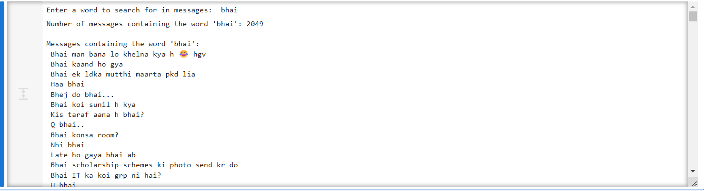

# Whatsapp-Chat-Analyser
A python based project to create neccessary data analytics on whatsapp chat file

# Chat Analyzer

This project analyzes chat data from a given source file and provides various insights such as top authors, word clouds, and message searches.

## Requirements

- pandas
- plotly
- matplotlib
- wordcloud

## Setup

1. Clone the repository.
2. Install the required packages:
   ```bash
   pip install pandas plotly matplotlib wordcloud
## Output Pics

